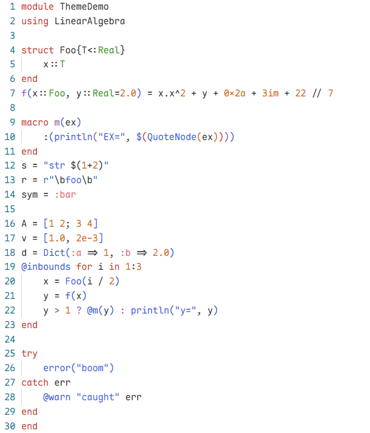
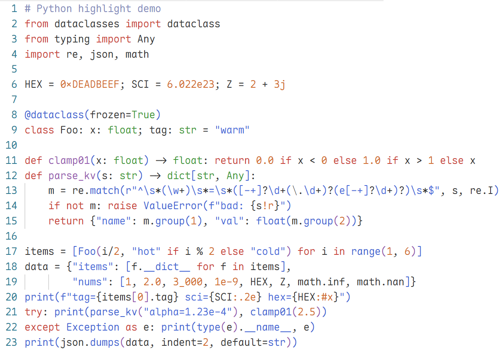
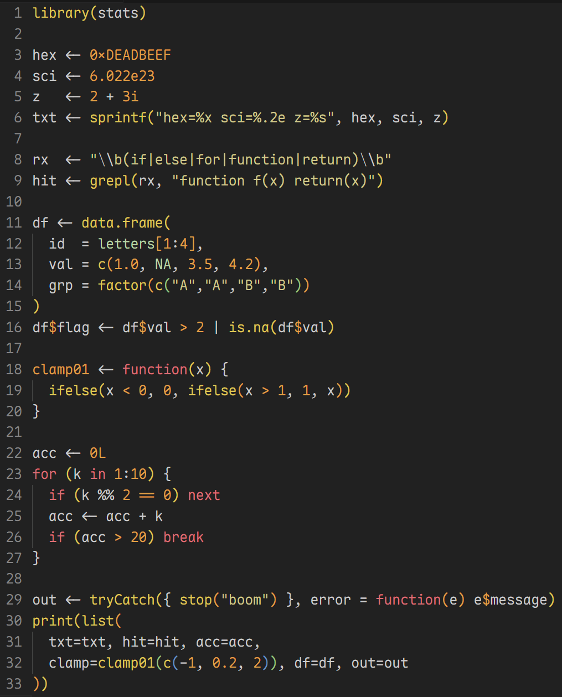
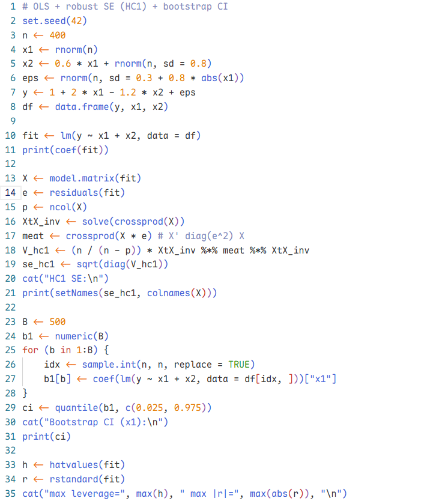

# Shakira Warm Spectrum

Warm-spectrum color themes (Dark + Light) with vibrant syntax highlighting.

## Supported Languages

- JavaScript (including JSX)
- Julia
- MATLAB
- Python
- R
- TypeScript (including TSX)

## Screenshots

| Language | Dark (Warm Spectrum) | Light (Julia Logo) |
| --- | --- | --- |
| Julia |  |  |
| Python |  |  |
| R |  |  |

## Highlights

Two variants:

- Dark (Warm Spectrum): warm palette tuned for readability.

- Light (Julia Logo): uses the four Julia logo colors as the primary accents.

## Install

- Open the Extensions view and search: `Shakira Warm Spectrum`
- Or run in Command Palette:
  - `Extensions: Install Extensions` -> search `Shakira Warm Spectrum`

## Use

Preferences: Color Theme -> choose:
- `Shakira Warm Spectrum Dark`
- `Shakira Julia Light`
