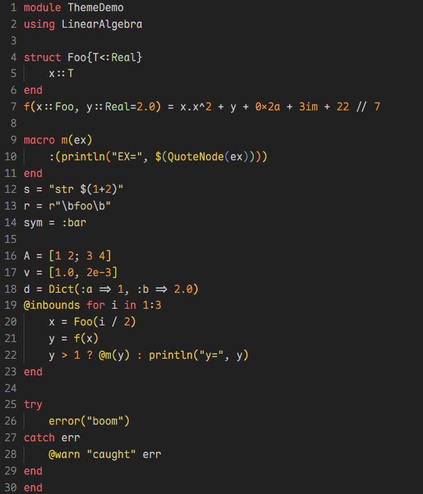

# Shakira Warm Spectrum

Warm-spectrum **Julia-first** color themes (Dark + Light) with vibrant syntax highlighting.

| Shakira Warm Spectrum Dark | Shakira Julia Light |
| --- | --- |
|  |  |

## Highlights

Two Julia-first variants:

**Dark (Warm Spectrum)** - warm palette tuned for Julia:
- **Functions:** red
- **Keywords:** yellow
- **Types:** green
- **Numbers:** orange

**Light (Julia Logo)** - uses the four Julia logo colors as the primary accents.

> Note: Many rules target Julia-specific scopes, so this theme is primarily intended for Julia.

## Install

- Open the Extensions view and search: `Shakira Warm Spectrum`
- Or run in Command Palette:
  - `Extensions: Install Extensions` -> search `Shakira Warm Spectrum`

## Use

`Preferences: Color Theme` -> choose:
- `Shakira Warm Spectrum Dark`
- `Shakira Julia Light`
